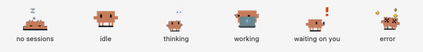

<p align="center">
  
</p>

<h1 align="center">Clawd Tank — menu bar edition</h1>

<p align="center">
  A little crab in your macOS menu bar that watches your Claude Code sessions,<br>
  and taps you on the shoulder when one of them is stuck waiting for you.
</p>

<p align="center">
  
  
</p>

---

## What this fork is

The [original Clawd Tank](https://github.com/marciogranzotto/clawd-tank) by
[@marciogranzotto](https://github.com/marciogranzotto) is a **physical
notification display**: a tiny ESP32 board with a 320×172 screen that sits on
your desk, where a pixel-art crab named Clawd reacts to your Claude Code
sessions over Bluetooth. It's a lovely piece of hardware hacking, and Clawd —
the character, the sprites, the whole personality — is theirs.

This fork asks a different question: **what if you don't have the board?**

Same crab, same idea, no hardware. Clawd moves into the menu bar. The ESP32
firmware, the SDL2 desktop simulator and the Bluetooth transport are gone; what
used to be a control panel for a device is now the entire app.

The trade is straightforward. You lose the physical object on your desk — which
is genuinely the best part of the original. You gain something that works on any
Mac, costs nothing, takes no space, and can show things a 320×172 screen never
could: project names, elapsed times, rate limits, and a click that jumps you
straight back to the terminal a session is waiting in.

## What you actually see

### The icon

One crab, telling you the single most important thing happening right now.

<p align="center">
  
</p>

When several sessions disagree — one thinking, one running tests, one blocked on
a permission prompt — the most *actionable* one wins:

> **error** › **waiting on you** › **working** › **thinking** › **idle**

That ordering is the whole point. A session waiting for your approval is the
only one that can't make progress without you, so it's never hidden behind three
busier-looking ones.

Next to the crab you sometimes get a number: `3` when three sessions are running,
`2!` when two are waiting on you. Never `1` — with a single session the number
tells you nothing, and it would just make the icon jiggle every time a session
starts or stops.

### The popover

Click the crab. One row per live session:

- **which crab** — reading, editing, running a command, searching the web,
  conducting subagents. The sprite matches what that session is doing right now.
- **the project**, and underneath it, what it's up to in plain words
- **how long** since it last did anything
- **an orange stripe** if it's waiting on you, red if it errored
- **⌁ 3** if it has subagents running

Rows are sorted the same way the icon picks its face: whoever needs you most is
at the top.

**Click a row and the app that session lives in comes to the front** — your
terminal, or VS Code with the right window focused. More on how that works below,
because it's the part with the fun trick in it.

### The usage bars

Underneath, how much of your 5-hour session window and your weekly window you've
burned, and when each resets. Amber past 75%, red past 90%, so "I'm nearly out"
reads without doing arithmetic.

Right-click the crab (or hit ⚙ Settings in the popover) for the settings menu.

---

## How it works

The nice thing about this design is that there's no polling, no scraping, and no
guessing. Claude Code volunteers everything.

### 1. Claude Code has hooks

Hooks are little commands Claude Code runs at specific moments — when a session
starts, before it uses a tool, when it needs your permission, when it finishes a
turn. You tell it about them in `~/.claude/settings.json`.

Clawd Tank installs exactly one: a small script at
`~/.clawd-tank/clawd-tank-notify`. It uses nothing but the Python standard
library, because it runs on *every* one of those moments and has no business
slowing your session down to import things.

### 2. The script whispers into a socket

The script's entire job is to translate a hook payload into a small JSON message
and drop it into a Unix socket at `~/.clawd-tank/sock`. Then it exits. It never
waits for a reply, never talks to the network, never blocks Claude.

```
Claude Code hook  →  clawd-tank-notify  →  ~/.clawd-tank/sock
```

### 3. A daemon keeps a story per session

Inside the menu bar app, on a background thread, a small asyncio daemon listens
on that socket and keeps a state machine for every session it's heard from:

```
registered → thinking → working → idle
                  ↓
              waiting  (blocked on your approval or your answer)
              confused (a tool failed)
              error    (the turn died)
```

It also quietly cleans up after itself. A session that goes silent past your
timeout gets dropped — **except** one that's *waiting on you*, which legitimately
sits there emitting nothing precisely when it matters most. And every 30 seconds
it checks whether each session's `claude` process still exists, so closing a
terminal makes that row disappear rather than lingering as a ghost.

State is saved to `~/.clawd-tank/sessions.json`, so quitting and reopening the
app doesn't lose track of what's still running.

### 4. The daemon hands the UI a picture, not a to-do list

Whenever something changes, the daemon builds a plain snapshot — a list of
dictionaries, one per session — and pushes it to the menu bar.

Two small decisions do a lot of work here:

**It waits 150 ms first.** A single Claude turn fires several hooks in a row, and
four parallel sessions can produce a dozen messages in under a tenth of a second.
Rebuilding the UI once per message would thrash the main thread for no benefit.
So a burst collapses into one update, which is still far faster than you can
perceive.

**It sends a copy, never a reference.** The daemon mutates its state on a
background thread while AppKit reads it on the main thread. Handing over a live
reference would be a data race waiting to happen. The copy *is* the thread-safety
story.

### 5. Clicking a row: the process tree knows

Claude Code never says which app it's running inside. But the operating system
does, if you walk up the family tree from the session's process:

```
Terminal:  claude → -zsh → login → Terminal.app
VS Code:   claude → Code Helper (Plugin) → Visual Studio Code.app
```

So that's what happens on a click — walk up until you hit something that lives in
a `.app` bundle, then bring it forward.

Electron makes this less obvious than it looks. A VS Code session's parent is
`Code Helper (Plugin)`, which is itself an app bundle *nested inside* Visual
Studio Code — and macOS doesn't consider it a running application, so you can't
activate it. The walk has to keep climbing until it leaves the bundle entirely
and lands on the real `Code` process.

Editors get one extra courtesy: they keep one window per folder, so the session's
working directory is passed along and *that* window comes forward, not whichever
one you used last. Terminals deliberately don't get it — handing a terminal a
directory opens a brand new window instead of surfacing the one you wanted.

### 6. Where the numbers come from

**Today's totals** are read straight out of the session transcripts in
`~/.claude/projects/`, where Claude Code records every turn along with the
model's own token accounting. Only files touched since midnight are opened, and
inside them only lines that mention usage are parsed — which skips your prompts
and attachments, the bulk of the bytes. A full day is around 40 ms.

**The rate-limit bars** come from `~/.claude.json`, the only place on disk any of
this exists.

There's an honest caveat here worth stating plainly: Claude Code writes that
field when it asks the API about your usage, **not on a timer**. It can sit
untouched for days. So rather than trusting it, the app checks it:

| What it found | What you see |
|---|---|
| A current reading | `47%` and `resets in 2h 37m` |
| An old reading, window still open | `≥47%` and `Measured 2h ago` |
| The window already reset | No bars — *run `/usage` in Claude Code to refresh* |

The `≥` isn't decoration. Inside a live window usage only ever climbs, so a
cached number is a **floor**, not a wrong number. And the countdown stays exact
either way, because the reset time is known and the clock is local.

If the bars look empty, run `/usage` once in any Claude Code session. After that
they stay accurate for the rest of the window on their own.

---

## Getting it running

```bash
cd host
python3 -m venv .venv && .venv/bin/pip install -r requirements-dev.txt
./build.sh --install
```

No Xcode, no Homebrew, no compilers. It's Python plus pyobjc, which arrives with
`rumps` — the app bundles itself with py2app.

Then launch it, right-click the crab, and pick **Install Claude Code Hooks**.
Restart any sessions you already have open. That's the whole setup.

### Settings

Right-click the crab, or use ⚙ Settings in the popover:

- **Session Timeout** — how long a quiet session survives before it's dropped
- **Alert Sounds** — Submarine when a session becomes blocked on you, Glass when
  Claude finishes a turn
- **Install Claude Code Hooks** — also re-runs itself on launch when the hooks
  fall out of date
- **Launch at Login**

### Tests

```bash
cd host && .venv/bin/pytest -q
```

The pure logic — which crab wins, how rows sort, what a row says, how usage is
counted — is deliberately kept in modules that never import AppKit, so most of it
is testable without a window server.

---

## Credit

Clawd, the crab, the sprites, the animations, the hooks architecture and the
original idea are all [@marciogranzotto](https://github.com/marciogranzotto)'s
work in [marciogranzotto/clawd-tank](https://github.com/marciogranzotto/clawd-tank).
If you like this, go build the actual device — it's better.

This fork only moved the crab somewhere else. The name stayed even though there's
no tank anymore; too many paths depend on it, and honestly Clawd had earned it.

The hardware era is all still in the git history if you want to read it.

## License

See [LICENSE](LICENSE).
